# 💡 光通訊收發模組 (Optical Transceiver Module)

本專案實作了一套基於可見光通訊 (Visible Light Communication, VLC) 的硬體收發系統。內容涵蓋電路設計、實體電路板焊接、Arduino ADC 超頻取樣設定，以及運用 MATLAB 進行後端數位訊號處理與波形重建。

## 🔌 硬體電路設計 (Hardware Design)

系統分為發射端 (TX) 與接收端 (RX) 兩部分，採用光二極體進行光能與電能之轉換：

*   **發射端 (TX)：** 負責將類比音訊/數位編碼訊號載入光源。
    *   實體電路： 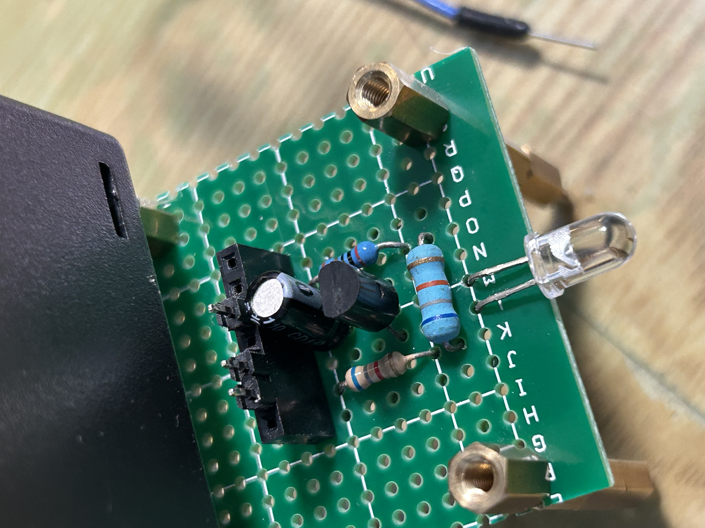
    *   電路接線圖： 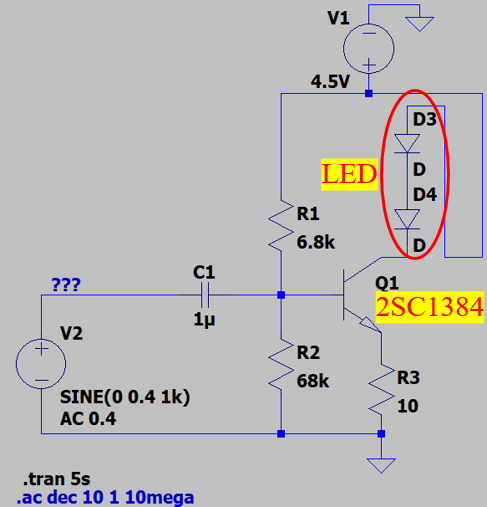
*   **接收端 (RX)：** 核心感測元件使用 **BPW-34** 光二極體 (Photodiode)，搭配 OPA 放大電路擷取微弱的光訊號。
    *   實體電路： 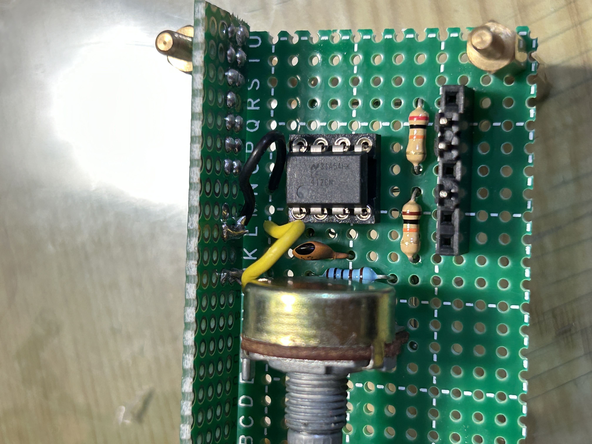
    *   電路原理圖： 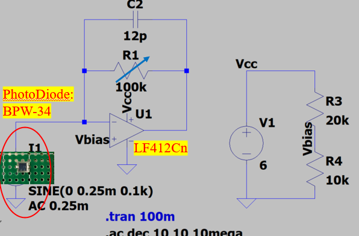
    *   光電元件 BPW-34： 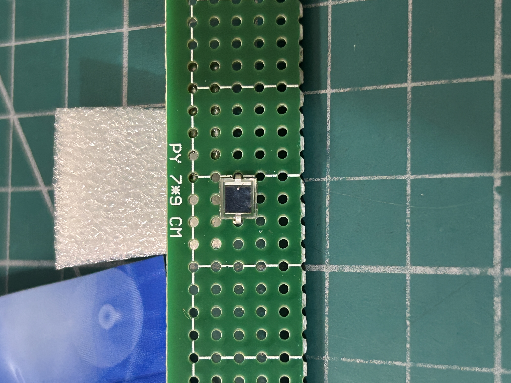

## ⏱️ 取樣理論與 ADC 設定 (Sampling Theory & ADC)

為了解決高頻訊號失真問題，本專案對 Arduino 的底層 ADC 暫存器進行超頻設定：

*   **ADC 除頻器設定：** 依據下表調整 Prescaler Divisor 預除頻器以提高轉換速率。 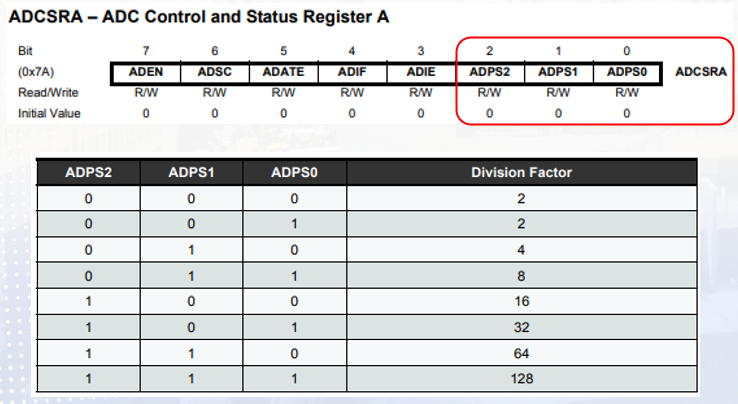
*   **取樣時序分析：** 因本實驗不須高解析度，由 Datasheet 可知，SAR ADC的輸入頻率大於 200kHz，雖可能會造成失真但可得到較高的取樣率。 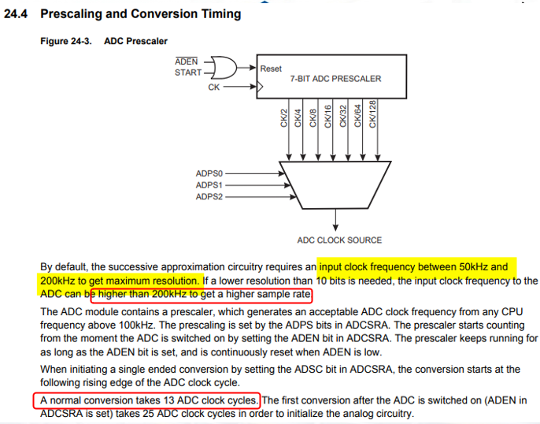
*   **Nyquist 採樣定理驗證：** 確保系統取樣率 $f_s \ge 2f_{max}$，避免訊號混疊 (Aliasing)。如下圖計算可知，本系統可接收小於 38.462kHz 的訊號。 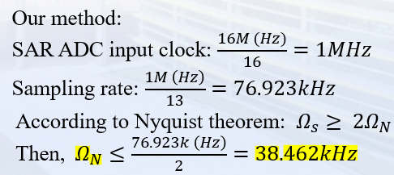

## ✨ 核心實作展示 (Demos)

### 🎵 Demo 1: 類比音訊光傳輸 (Audio Transmission)
透過光訊號傳遞音訊訊號，並使用 MATLAB 將擷取到的原始訊號進行濾波，利用 `y - mean(y)` 消除硬體產生的直流偏壓 (DC Bias)。
*   **MATLAB 處理波形：** 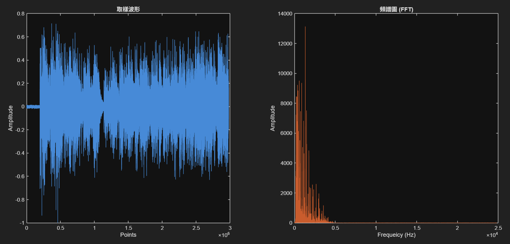
*   **MATLAB 透過序列埠接收濾波後音訊結果：**  <audio src="./BASE/VLC_Demo1_Audio_Filtered.wav" click here to listen received signal></audio>

### 🔢 Demo 2: 數位方波解碼 (Digital Square Wave Decoding)
發送端載入未知編碼後的數位方波，接收端透過 MATLAB 進行精準的電壓映射與邏輯位準判斷，透過給定的 decode rule (如 start bit + ascii code + end bit)，成功還原數位資訊。
*   **解碼波形結果：** 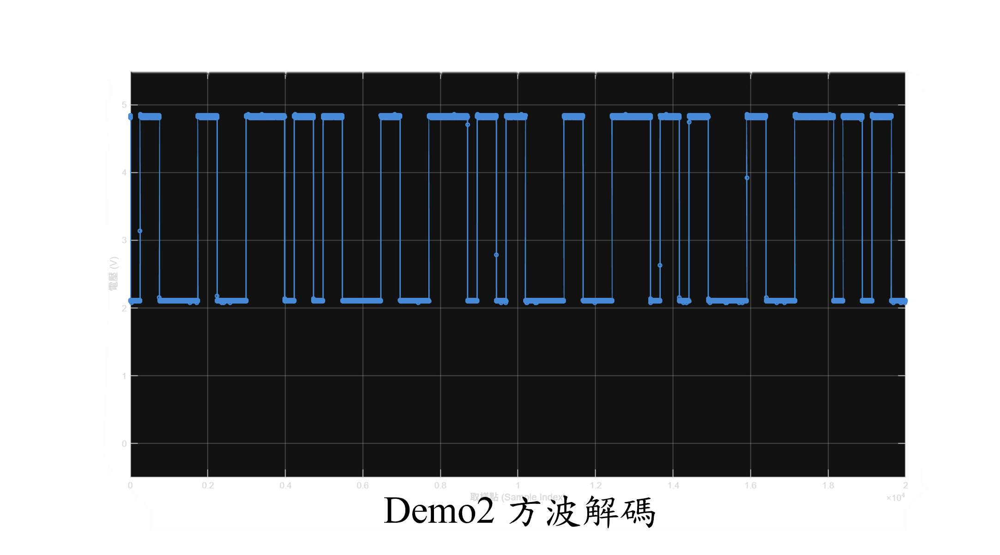

### 📈 Demo 3: 模組頻寬量測 (Bandwidth Measurement)
針對實體焊接的光電收發電路進行極限測試，量測電路的頻率響應與極限頻寬。
*   **示波器頻寬量測：** 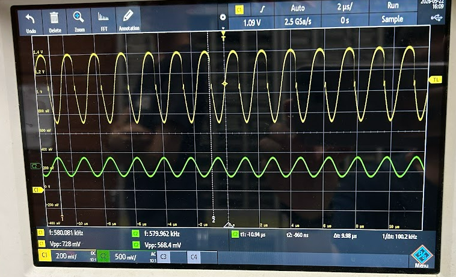
*   **LTspice 模擬 TX 頻率響應：** 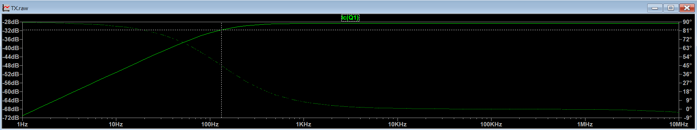
*   **LTspice 模擬 RX 頻率響應：** 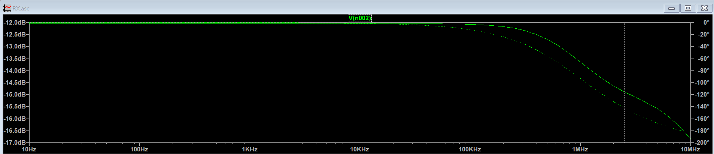
*   **測驗時的整體效能與數據總結：** 

## 🚀 開發工具 (Tech Stack)
*   **微控制器：** Arduino Nano (C++)
*   **訊號分析：** MATLAB
*   **電路/音訊分析工具：** LTspice、Audacity、示波器